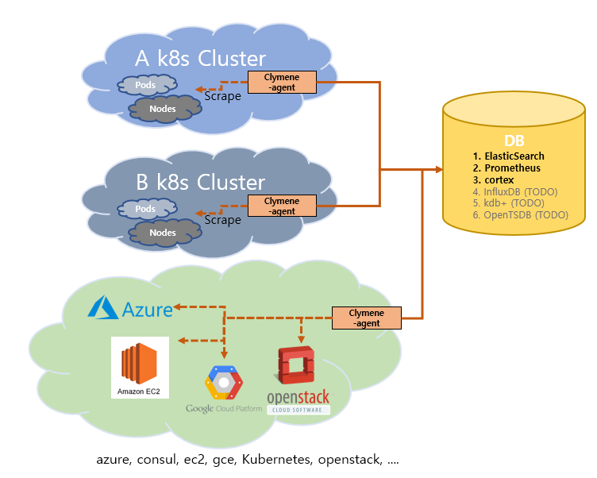
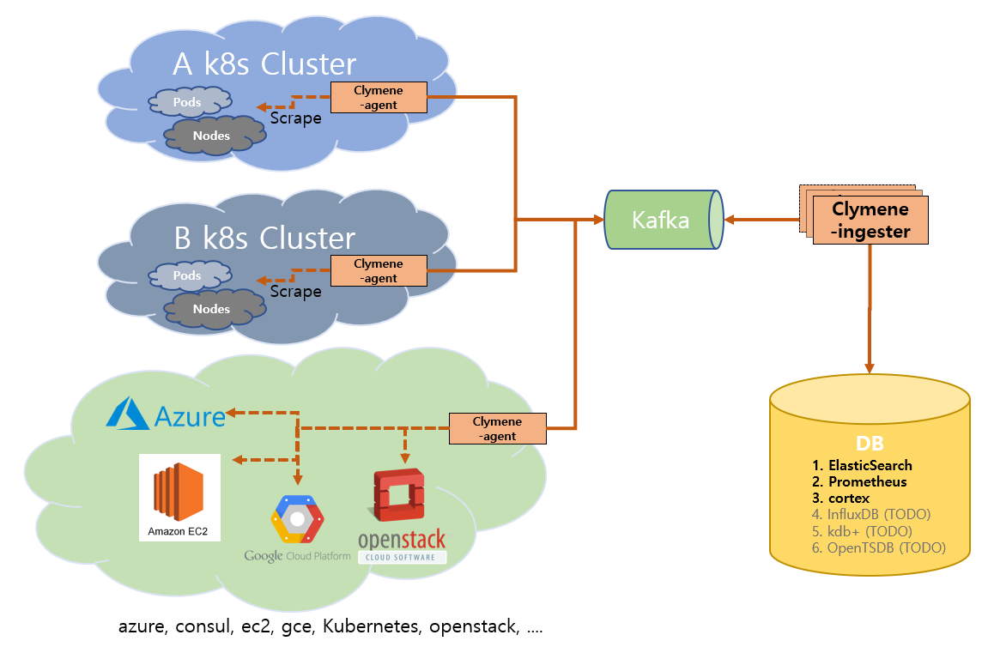

# Clymene

The Clymene is a time series data collection platform for distributed systems inspired by [Prometheus](https://prometheus.io)
and [Jaeger](https://www.jaegertracing.io). Time series data from various environments can be collected and stored in
different types of databases. Various time series data analysis functions will be added.

Clymene는 [Prometheus](https://prometheus.io)와 [Jaeger](https://www.jaegertracing.io)에서 영감을 받은 분산 시스템을 위한 시계열 데이터 수집 플랫폼입니다.
다양한 환경의 시계열 데이터를 수집하고 여러 종류의 데이터베이스에 저장할 수 있습니다. 다양한 시계열 데이터 분석 기능이 추가될 예정입니다.

# Architecture

## Release v1.0.0

### Use only agent(Agent만 사용)

### Including kafka and ingester(Kafka 사용 시)

# components

### Clymene Agent([Getting Started](./docs/clymene-agent/README.md))

The Clymene-agent is service that collects time series data(does not use disks)

1. Service Discovery
   - [Prometheus's Service Discovery](https://docs.sysdig.com/en/docs/sysdig-monitor/integrations-for-sysdig-monitor/collect-prometheus-metrics/enable-prometheus-native-service-discovery/)
   feature finds Metric collection endpoints.
2. scrape time series data
3. Time-series data transfer to gateway(gRPC) (Optional) (TODO)
4. Time-series data transfer to kafka (Optional)
5. Time-series data insert to Database(ElasticSearch, Prometheus, ETC) (Optional)

### Clymene Ingester(Optional) ([Getting Started](./docs/clymene-ingester/README.md))  

The Clymene ingester is an optional service responsible for insert time series data loaded on kafka into the database.  
1. Kafka message consume  
2. Time-series data insert to Database(ElasticSearch, Prometheus, ETC) (Optional)  

### Clymene Gateway(Optional) (Coming to v1.1.x)

The Clymene gateway is an optional service responsible for produce Time series data message to kafka from clymene agent.

## Roadmap

1. Various DB support(influxdb, kdb, opentsdb, druid)
2. AI/ML platform for clymene(https://github.com/Clymene-project/clymene-analyzer)
3. Website development for clymene(https://github.com/Clymene-project/documentation)

# Code Style

#### 1. https://github.com/golang/go/wiki/CodeReviewComments

#### 2. https://peter.bourgon.org/go-in-production/#formatting-and-style    

