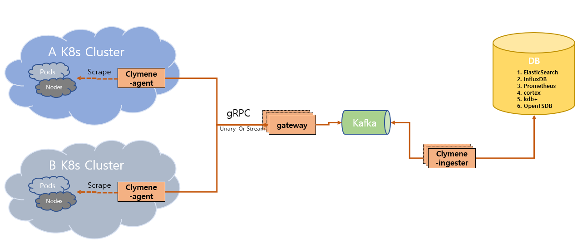

# Clymene  

Clymene is the mother of Prometheus in Greek and Roman mythology. The Clymene project, inspired by the Prometheus project(https://prometheus.io/). It will be developed as an agent by separating scrape parts from the time series data collection method of the prometheus project. the resource consumption of agents will be very small. The data collection architecture using an agent becomes an architecture that can collect data from various environments and retrieve it from a single backend. For example, you can collect time series data from multiple Kubernetes(k8s) clusters to view results of queries from the single backend. In addition, notification is possible using time series data collected from multiple environments. Clymene will be used for monitoring various environments and is a suitable architecture for integrated monitoring.  

# Architecture  
### Release 0.0.1   

# components  
### Clymene Agent  
The Clymene-agent is service that collects time series data  
1. Service Discovery   
2. scrape time series data  
3. Time-series data transfer to gateway(gRPC) (Optional)  
4. Time-series data produce to kafka (Optional)  
5. Time-series data insert to Database (Optional)  

### Gateway(Optional)  
The gateway is an optional service responsible for produce Time series data message to kafka from clymene agent.  

### Ingester(Optional)
The ingester is an optional service responsible for  insert time series data loaded on kafka into the database.  

# Code Style
#### 1. https://github.com/golang/go/wiki/CodeReviewComments  
#### 2. https://peter.bourgon.org/go-in-production/#formatting-and-style    
