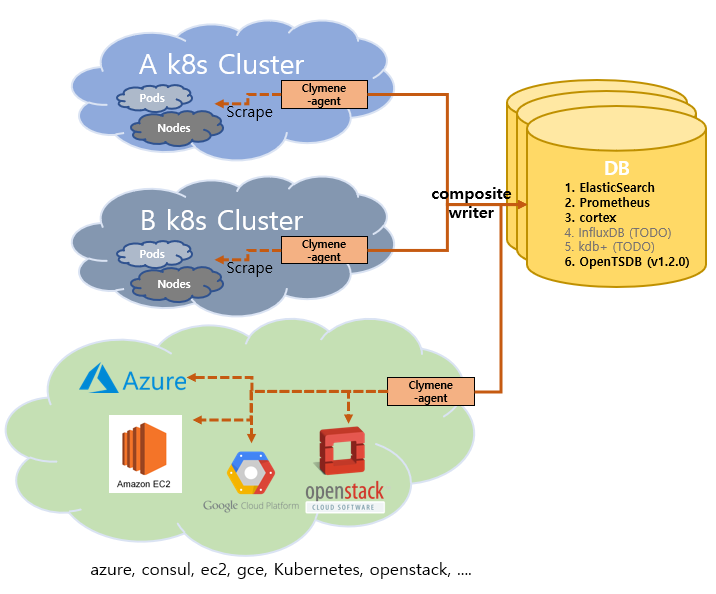
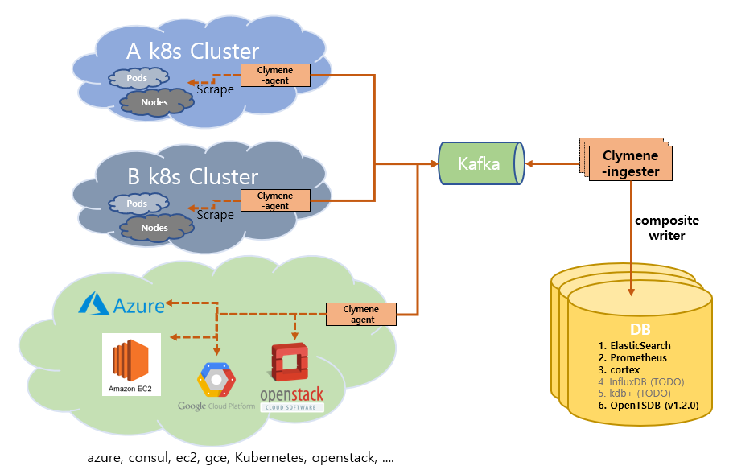
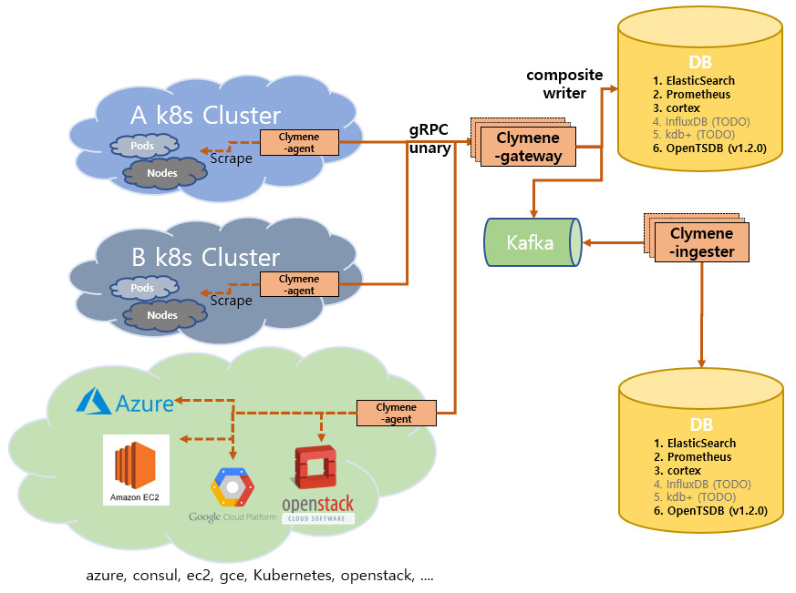

# Clymene

The Clymene is a time series data collection platform for distributed systems inspired by [Prometheus](https://prometheus.io)
and [Jaeger](https://www.jaegertracing.io). Time series data from various environments can be collected and stored in
different types of databases. It can be configured in a variety of architectures. Various time series data analysis functions will be added.

Clymene는 [Prometheus](https://prometheus.io)와 [Jaeger](https://www.jaegertracing.io)에서 영감을 받은 분산 시스템을 위한 시계열 데이터 수집 플랫폼입니다.
다양한 환경의 시계열 데이터를 수집하고 여러 종류의 데이터베이스에 저장할 수 있습니다. 여러 컴포넌트를 이용해 다양한 아키텍처로 구성할 수 있습니다. 다양한 시계열 데이터 분석 기능이 추가될 예정입니다. 

# Architecture

## Release v1.2.0

### Use only agent(Agent만 사용)  
Agent can store time series data in a variety of DBs and support Composite Writers that can be stored in multiple DBs at once.  

[//]: # (![Release_1.0.0.png]&#40;docs/images/clymene_architecture_v1.0.0_composite.png&#41;)


### Including kafka and ingester(Kafka 사용 시)  
Ingester consumes time series data loaded on kafka, can store time series data in various DBs, and supports Composite Writers that can be stored in multiple DBs at once.  

  


### Use gateway(Gateway 사용 시)  
Gateway collects time series data through gRPC communication, stores time series data in various DBs, and supports Composite Writers that can be stored in multiple DBs at once.  




# components

### Clymene Agent([Getting Started](./docs/clymene-agent/README.md))
```official docker image: bourbonkk/clymene-agent:v1.2.0```  
The Clymene-agent is service that collects time series data(does not use disks)

1. Service Discovery
   - [Prometheus's Service Discovery](https://docs.sysdig.com/en/docs/sysdig-monitor/integrations-for-sysdig-monitor/collect-prometheus-metrics/enable-prometheus-native-service-discovery/)
   feature finds Metric collection endpoints.
2. scrape time series data
3. Time-series data transfer to gateway(gRPC) (Optional) (TODO)
4. Time-series data transfer to kafka (Optional)
5. Time-series data insert to Database(ElasticSearch, Prometheus, gateway, ETC) (Optional)


### Clymene Ingester(Optional) ([Getting Started](./docs/clymene-ingester/README.md))  
```official docker image: bourbonkk/clymene-ingester:v1.2.0```  
The Clymene ingester is an optional service responsible for insert time series data loaded on kafka into the database.  
1. Kafka message consume  
2. Time-series data insert to Database(ElasticSearch, Prometheus, gateway, ETC) (Optional)  

### Clymene Gateway(Optional) ([Getting Started](./docs/clymene-gateway/README.md))  
```official docker image: bourbonkk/clymene-gateway:v1.2.0```  
The Clymene Gateway is an optional service that can receive metric data from the another component through gRPC communication.  
1. gRPC Service  
2. Time-series data insert to Database(ElasticSearch, Prometheus, ETC) (Optional)  

## How to work it on k8s  

For example, see the [clymene_using_gateway.yaml](./k8s/Clymene_using_gateway.yaml)

## How to work it on docker-compose  

For example, see the [docker-compose-clymene_using_gateway.yml](./docker-compose/docker-compose-clymene_using_gateway.yml)

## Roadmap

1. Various DB support(influxdb, kdb, opentsdb, druid)
2. AI/ML platform for clymene(https://github.com/Clymene-project/clymene-analyzer)
3. Website development for clymene(https://github.com/Clymene-project/documentation)

## Get in Touch
Have questions, suggestions, bug reports? Reach the project community via these channels:

* GitHub [issues](https://github.com/clymene-project/clymene/issues)


# Code Style

#### 1. https://github.com/golang/go/wiki/CodeReviewComments

#### 2. https://peter.bourgon.org/go-in-production/#formatting-and-style    

