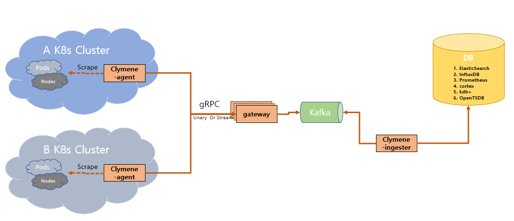

# Clymene  

Clymene is the mother of Prometheus in Greek and Roman mythology. The Clymene project, inspired by the Prometheus project(https://prometheus.io/). It will be developed as an agent by separating scrape parts from the time series data collection method of the prometheus project. the resource consumption of agents will be very small. The data collection architecture using an agent becomes an architecture that can collect data from various environments and retrieve it from a single backend. For example, you can collect time series data from multiple Kubernetes(k8s) clusters to view results of queries from the single backend. In addition, notification is possible using time series data collected from multiple environments. Clymene will be used for monitoring various environments and is a suitable architecture for integrated monitoring.  

furthermore, it will be improving Clymene's back-end architecture to a scalable scale-out architecture(after version 2.0.0).  

# Architecture  
### Release 1.0.0 (AS-IS)  

### Release 2.0.0 (TO-BE)  

# Code Style
#### 1. https://github.com/golang/go/wiki/CodeReviewComments  
#### 2. https://peter.bourgon.org/go-in-production/#formatting-and-style  

